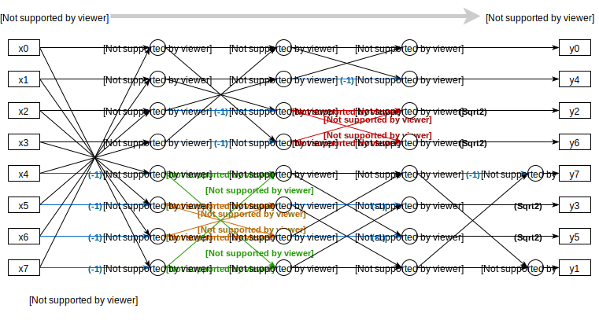
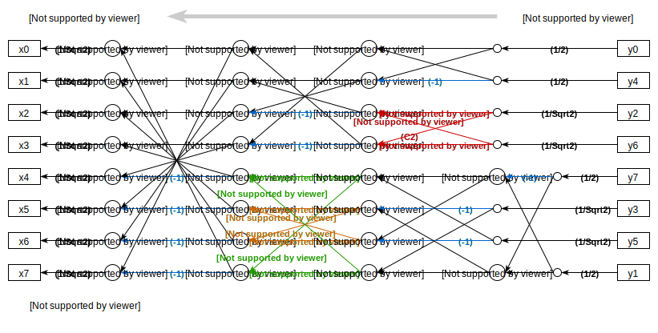
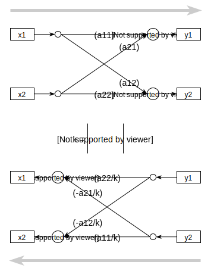

# Fourier

本仓库用于集中管理曾经实现过的、分散在各处的傅里叶变换的实现，包含：

- 快速傅里叶变换（类：`FFT`）
- 基于FFT的一维通用离散余弦变换（类：`DCT`）
- 8点快速离散余弦变换（函数：`DCT_8_fast`、`IDCT_8_fast`）
- 二维离散余弦变换（类：`DCT_2D`）

未来可能加入的其他变换：

- 改进的离散余弦变换（MDCT）
- 快速数论变换（Fast NTT）
- 小波变换
- 离散正弦变换（DST）
- K-L变换，等等

## 文档

8点快速DCT信号流图[1]：

8点快速IDCT信号流图（基于上面的信号流图推导）：

附：蝴蝶结反向的系数关系，本质上是解二元一次方程组。

- [1] Loeffler C , Ligtenberg A , Moschytz G S . **Practical fast 1-D DCT algorithms with 11 multiplications**[C]. ICASSP-89.

## 权利声明

版权所有 © 2016-2020 Mikukonai@GitHub，保留所有权利。

采用MIT协议授权。

本系统为个人以学习和自用目的所创作的作品。作者不对此系统的质量作任何承诺，不保证提供任何形式的解释、维护或支持，也不为任何人使用此系统所造成的任何正面的或负面的后果负责。
